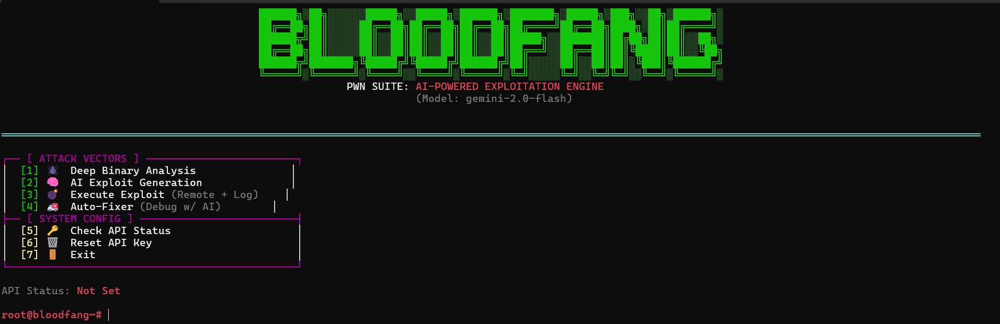

# 🩸 BloodFang


> **The Autonomous AI-Powered Binary Exploitation Engine.**



**BloodFang** is a next-generation CTF and Exploit Development framework. It automates the entire offensive lifecycle—from deep binary analysis to vulnerability detection, payload generation, and autonomous self-healing execution.

Powered by **Google Gemini 2.0 Flash**, BloodFang replaces manual trial-and-error with algorithmic precision, capable of constructing ROP chains, Ret2Libc attacks, and correcting stack alignment issues in real-time.

---

## ⚡ Key Features

### 🕷️ Deep Binary Reconnaissance
Automatic extraction of critical binary data using `checksec`, `readelf`, `ROPgadget`, and `strings`. BloodFang parses raw output to detect:
* **Stack Buffer Overflows** (gets, strcpy) 
* **Format String Vulnerabilities** 
* **Backdoor Functions** (win/system) 
* **Security Mitigations** (NX, PIE, Canary, RELRO) 

### 🧠 Generative Exploit Engine
Uses a strictly context-aware AI prompt (`promp_1.txt`) to generate production-ready `pwntools` scripts. It automatically decides between:
* **Ret2PLT**: If `system` is available in PLT.
* **Ret2Libc**: Automatic leak chain generation (puts/printf) + Libc base calculation. [cite: 32]
* **Shellcode Injection**: If NX is disabled. 

### 🚑 Auto-Fixer (Self-Healing)
If an exploit fails, BloodFang doesn't just stop. The **Fixer Module** (`fixer.py`) analyzes the crash log (`log_error.txt`) and applies logic gates:
* **Gate 1 (Symbol Error):** Switches payload strategy (e.g., from Ret2PLT to Ret2Libc). [cite: 3]
* **Gate 2 (Segfault/EOF):** Injects `RET` gadgets to fix Ubuntu/GLIBC stack alignment (MOVAPS issues). [cite: 8]
* **Gate 3 (Desync):** Adjusts I/O interaction (recvuntil/clean). [cite: 11]

### 🛡️ Smart Execution Monitor
Includes a threaded supervisor (`executor.py`) that monitors remote connections. [cite_start]It detects "Hanging/Stuck" processes and kills them automatically to prevent zombie connections during mass exploitation. 

---

## 🚀 Installation

### Prerequisites
* Python 3.8+
* Linux Environment (Kali/Ubuntu recommended for Pwn tools)
* Standard binary analysis tools: `checksec`, `ROPgadget`, `readelf`, `ltrace`.

### Setup

1.  **Clone the Repository**
    ```bash
    git clone [https://github.com/USERNAME/BloodFang.git](https://github.com/USERNAME/BloodFang.git)
    cd BloodFang
    ```

2.  **Install Dependencies**
    ```bash
    pip install -r requirements.txt
    ```

3.  **API Configuration**
    BloodFang requires a valid Google Gemini API Key.
    * Run the tool for the first time: `python3 main.py`
    * Enter your API Key when prompted.
    * *The key is securely stored in `.gemini_key` locally.* 

---

## 📖 Usage Workflow

Start the console:
```bash
python3 main.py
